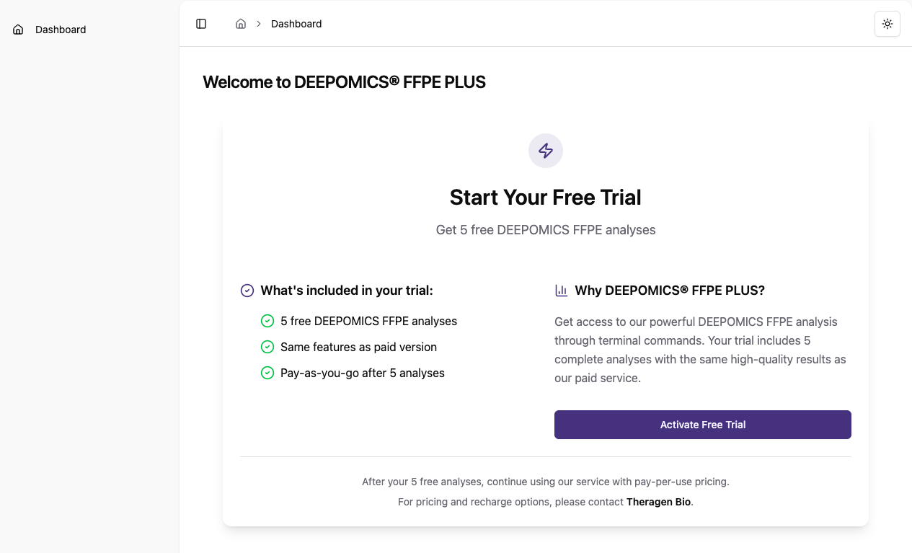
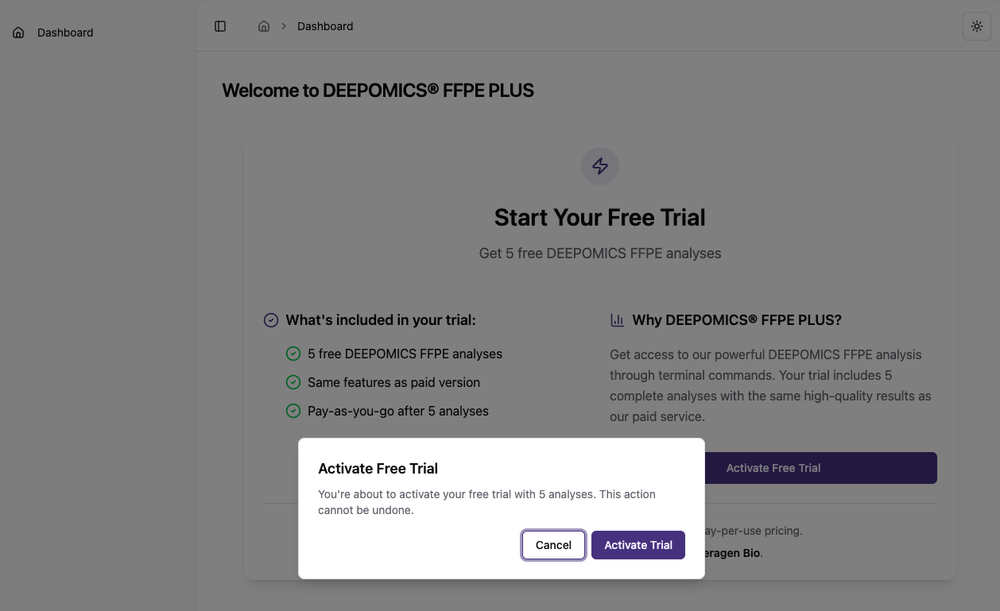

# DEEPOMICS FFPE User Guide - ENG

Version: 0.3.0
Update date: 2025.11.06

---

---

# 1. Introduction to DEEPOMICS FFPE

<aside>
📢

**DEEPOMICS FFPE** is a deep learning-powered analysis engine designed to accurately filter out FFPE-induced sequencing artifacts while preserving true somatic variants with high precision.

### What is FFPE?

**FFPE (Formalin-Fixed Paraffin-Embedded)** is the global standard for preserving biopsy tissue. Samples are fixed in formalin and embedded in paraffin blocks, allowing for long-term storage and transportation while maintaining tissue morphology.

However, this preservation process often introduces significant DNA damage, resulting in up to **83% artifactual variants**alongside true somatic mutations. Most of these artifacts are **C:G>T:A substitutions**, primarily caused by cytosine deamination. These artifacts significantly complicate accurate somatic variant detection.

---

### Why Accurate Variant Detection Matters

Accurate identification of somatic mutations is essential for advanced clinical applications such as:

- **Personalized cancer vaccine development**
- **Minimal residual disease (MRD) detection**

Both of these depend heavily on high-accuracy NGS data to guide clinical decisions.

---

### How DEEPOMICS FFPE Solves the Problem

**DEEPOMICS FFPE** uses proprietary deep learning models and optimized data processing pipelines to eliminate more than **96% of FFPE-derived artifacts**.

By dramatically improving the precision of variant detection, DEEPOMICS FFPE overcomes traditional FFPE limitations and enables more reliable and actionable sequencing data for clinical and research applications.

</aside>

# 2. Trial Access
### 🧪 Notice : Beta service is now available. You can use it for free.

- When you sign up, you’ll get up to 5 free analysis runs to try out the service.

<div align="center">
  
  <br>
  
</div>

# 3. Getting Your API Key

<aside>
🔐

**The API Key is your personal access key for DEEPOMICS FFPE analyses.**

You’ll need this key to submit analysis requests. It helps us identify your requests and make sure everything runs smoothly.

**Important:** Your usage and billing are linked to this API Key, so please keep track of how your keys are used.

**⚠️ Keep your key safe!**

If someone else gets access to your API Key, they could run analyses on your behalf and generate charges. In such cases, you’ll be responsible for any costs incurred.

</aside>

## 3.1. How to Create an API Key

- Go to the [🔗Create API Key page](http://dofp-service.ptbio.kr/api/key/create).
    - You can also find it in your user page: [API Key] > [Create].
- Fill in the details and click [Create].
    - **API Key Name:** Choose a name that helps you easily identify the key’s purpose.
    - **API Key Description:** Optionally, add more details about the key.
    - **API Key Expire Date:** Set how long the key should stay active (e.g. `1 Day`, `1 Year`, or `Never Expired`).
- After creating, click [Go to Detail] to view your new API Key.
    
    ⚠️ **Note:** For security reasons, your API Key will only be shown once right after it’s created. Make sure to copy and save it in a secure place.
    If you lose it, no worries — you can simply delete the old key and create a new one.
    


## 3.2. Managing and Deleting API Keys

- You can manage your API Keys anytime on the [🔗API List page](http://dofp-service.ptbio.kr/api/key/list).
- Here, you can deactivate or delete keys as needed.

# 4. Preparing Your Analysis Data

## 4.1. Input Files

To run DEEPOMICS FFPE analysis, you’ll need to prepare the following 3 files:

|  | Extension | Description |
| --- | --- | --- |
| VCF file | `.vcf` 또는 `.vcf.gz` | Variant Call Format file containing variant information |
| BAM file | `.bam` | Binary Alignment Map file containing aligned sequencing reads |
| BAM index file | `.bai` | Index file for the BAM file |
- The VCF and BAM files must come from the **same sample**.
- Special characters, spaces, or non-English characters (e.g. Korean) are not allowed in file names.

### 4.1.1. VCF File

- **File format**: Uncompressed (`.vcf`) or bgzip-compressed (`.vcf.gz`) VCF files
- **Required fields**:
    - `CHROM`: Chromosome where the variant is located (e.g. `chr1`)
    - `POS`: 1-based start position
    - `ID`: Variant ID (e.g. `rs1234` or `.`)
    - `REF`: Reference allele
    - `ALT`: Alternate allele(s), comma-separated if multiple
    - `QUAL`: Variant quality score (Phred scale; use `.` if not available)
    - `##contig`: Contig IDs and lengths for each chromosome
- **Example VCF file:**

```
##fileformat=VCFv4.2
##fileDate=20250610
##source=MyVariantTool_v1.0
##reference=file:///path/to/human_genome.fasta
##contig=<ID=chr1,length=248956422>
##contig=<ID=chr2,length=242193529>
##contig=<ID=chr3,length=198295559>
##INFO=<ID=DP,Number=1,Type=Integer,Description="Total Depth">
##INFO=<ID=AF,Number=A,Type=Float,Description="Allele Frequency">
##FILTER=<ID=PASS,Description="All filters passed">
##FILTER=<ID=LowQual,Description="Variant with low quality score">
##FORMAT=<ID=GT,Number=1,Type=String,Description="Genotype">
#CHROM	POS	ID	REF	ALT	QUAL	FILTER	INFO	FORMAT	SampleA
chr1	10000	rs12345	A	G	99	PASS	DP=150;AF=0.5	GT	0/1
chr1	10050	.	C	T	75	PASS	DP=120;AF=0.3	GT	0/0
chr2	50000	rs67890	G	A,T	80	LowQual	DP=80;AF=0.2,0.1	GT	1/2
chr3	15000	.	AG	A	60	PASS	DP=100;AF=0.7	GT	1/1
```

### 4.1.2. BAM File

- **Alignment**: BAM file aligned to the reference genome
- **Index file**: The corresponding `.bai` file is required
- **Reference genome**: Must match the reference genome used for the VCF file (e.g. `hg19/GRCh37`, `hg38/GRCh38`)
- The BAM file **must be sorted by chromosome coordinates**.
- It’s also highly recommended that you perform **duplicate marking or removal and base quality score recalibration (BQSR)** before submitting the BAM file.

# 5. Installing the CLI

## 5.1. Installation
### 5.1.1. Sign-up and sign-in
- https://deepomics-ffpe.theragenbio.com/

### 5.1.2. Visit the page below
- https://deepomics-ffpe.theragenbio.com/client-download
### <br/>

## 5.2. Running an Analysis

- Here’s an example of how to run an analysis using the CLI:

```bash
doffpe -v <input.vcf> \
		   -b <input.bam> \
		   -r <reference_version> \
		   -s <sequencing_type> \
		   -o <prefix> \
		   -O <output_dir> \
		   -t <threads> \
		   --api-key <your_api_key>
```

### 5.2.1. Key Options Explained

| Options | Required | Default | Value | Description |
| --- | --- | --- | --- | --- |
| `-v` , `--variant-file` | True | - | Path | Input variants file path |
| `-b` , `--bam-file` | True | - | Path | Input BAM file path |
| `-r` , `--ref-version`  | True | - | `hg19` , `hg38` | Reference genome version: `hg19` or `hg38` |
| `-s` , `--seq-type`  | True | - | `wes` , `wgs_pcr` , `wgs_pcrfree` | Sequencing type: "`wes`" for Whole Exome Sequencing, "`wgs_pcr`" for Whole Genome Sequencing with PCR-based library prep, or "`wgs_pcrfree`" for Whole Genome Sequencing with PCR-free library prep. |
| `-o` , `--output-prefix` | True | - | String | Prefix to be used for output file names |
| `-O` , `--output-dir` | False | DeepOmicsFFPE | String | Name of the directory to save the output files |
| `-t` , `--threads`  | False | All threads | Integer | Use multithreading with <int> worker threads |
| `--api-key` | True | - | String | To use this program, you must provide an API token. If you have used it previously, the token may already be stored in the [home_directory]/.dofp path, and you won't need to provide it again. |
| `--process-all-variants`  | False | - | - | If specified, include all variants regardless of FILTER status.
⚠️The use of this option is not recommended. It is strongly advised to analyze only variants with `FILTER==PASS`, as these represent high-confidence calls that are supported by the somatic variant caller. |

### 5.2.2. Quick Start

```bash
## Quick Start ## Test data
doffpe -v test/test.mutect2.filt.pass.vcf.gz -b test/test.mutect2.bam -r hg19 -s wes -o test -O DeepOmicsFFPE -t 8 --api-key <your_api_key>
```

# 6. Output Files

## 6.1. Result Files

| File name | Description |
| --- | --- |
| DeepOmicsFFPE.vcf.gz | This file contains the inference results from **DEEPOMICS FFPE** for all input variants included in the analysis request. |
| DeepOmicsFFPE.filtered.vcf.gz | This file contains only the variants predicted as true variants by **DEEPOMICS FFPE**, filtered based on its inference results. |
- **Example DeepOmicsFFPE.vcf.gz file:**

```
##fileformat=VCFv4.2
##fileDate=20250610
##source=MyVariantTool_v1.0
##reference=file:///path/to/human_genome.fasta
##contig=<ID=chr1,length=248956422>
##contig=<ID=chr2,length=242193529>
##contig=<ID=chr3,length=198295559>
##INFO=<ID=DP,Number=1,Type=Integer,Description="Total Depth">
##INFO=<ID=AF,Number=A,Type=Float,Description="Allele Frequency">
##FILTER=<ID=PASS,Description="All filters passed">
##FILTER=<ID=LowQual,Description="Variant with low quality score">
##FORMAT=<ID=GT,Number=1,Type=String,Description="Genotype">
##INFO=<ID=DeepOmicsFFPE_score,Number=1,Type=Float,Description="Predicted FFPE artifact score">
##INFO=<ID=IS_VARIANT,Number=1,Type=Integer,Description="Predicted FFPE artifact label (0 = Artifact or 1 = True variant)">
#CHROM	POS	ID	REF	ALT	QUAL	FILTER	INFO	FORMAT	SampleA
chr1	10000	rs12345	A	G	99	PASS	DP=150;AF=0.5;DeepOmicsFFPE_score=0.007;IS_VARIANT=0	GT	0/1
chr1	10050	.	C	T	75	PASS	DP=120;AF=0.3;DeepOmicsFFPE_score=0.999;IS_VARIANT=1	GT	0/0
chr2	50000	rs67890	G	A,T	80	LowQual	DP=80;AF=0.2,0.1;DeepOmicsFFPE_score=.;IS_VARIANT=.	GT	1/2
chr3	15000	.	AG	A	60	PASS	DP=100;AF=0.7;DeepOmicsFFPE_score=0.846;IS_VARIANT=1	GT	1/1
```

# 7. FAQ
